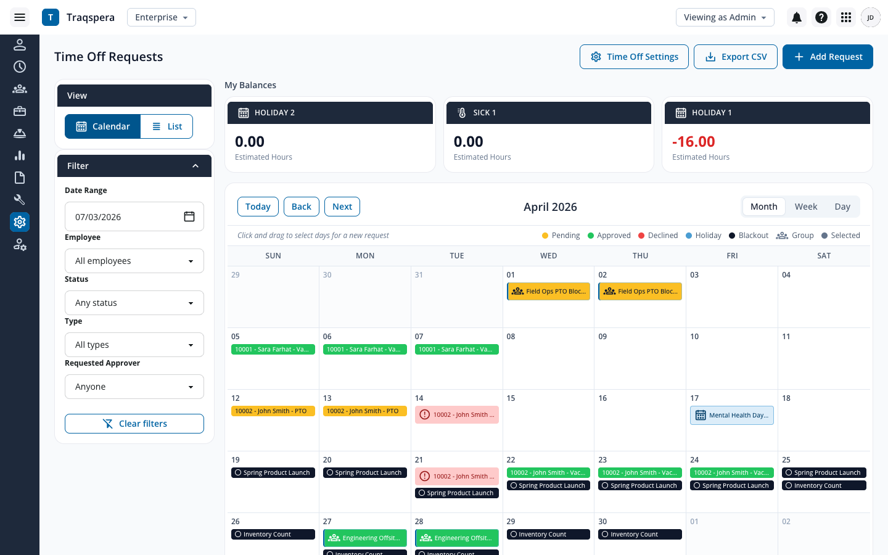
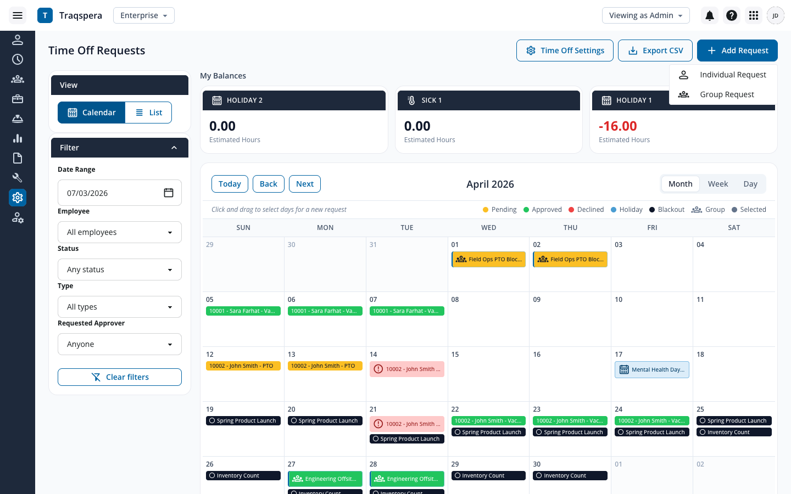
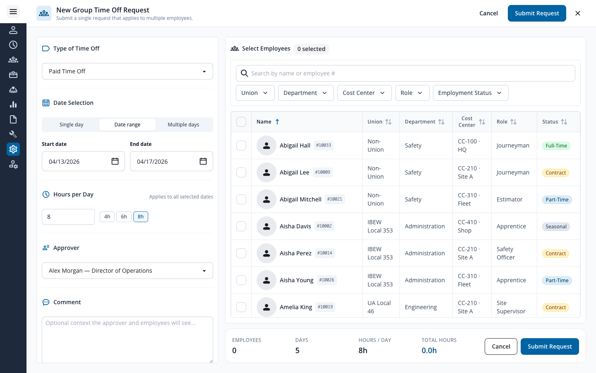
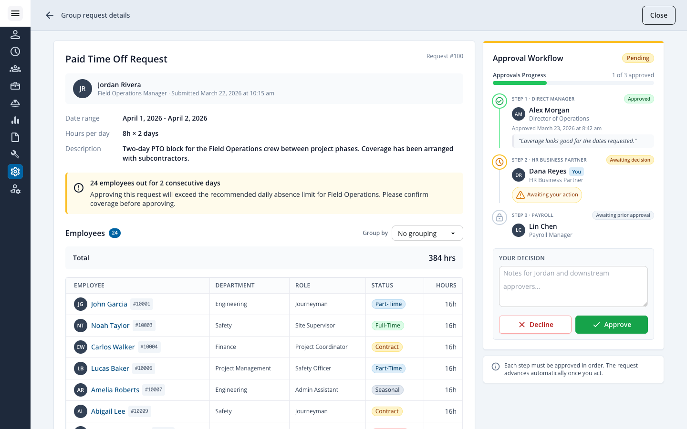
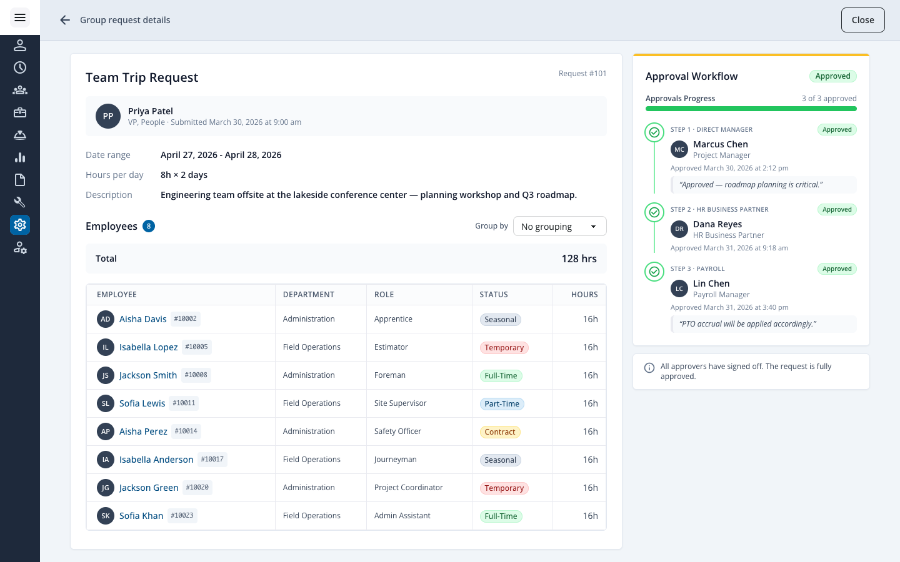

# Traqspera · Group Time Off Request Prototype

A React + Vite prototype that demonstrates the **Group Time Off Request** flow for the Traqspera Time Off Requests page, including the full review and approval workflow.

> Live prototype: <https://sarafarhat13.github.io/traqspera-group-time-off>

## Preview

| Time Off Requests page | Add Request menu |
| --- | --- |
|  |  |

| Create Group Request modal | Approval Workflow — pending |
| --- | --- |
|  |  |

| Approval Workflow — fully approved |
| --- |
|  |

## What's included

### Time Off Requests page
- Persistent left sidebar + top navbar built with Modus Web Components.
- Filter panel (Date Range, Employee, Status, Type, Approver) and Calendar / List view toggle.
- Balances strip (Holiday 2, Sick 1, Holiday 1) with mock balance data.
- April 2026 calendar with a mix of approved / pending / declined / holiday / blackout events.
- **Group requests** appear inline on the calendar with a `people_group` icon, a Modus-blue left accent, and a "Group" entry in the legend.

### Add Request menu
- Manager dropdown with two options: *Individual Request* and *Group Request*.

### Create Group Request (full-page modal)
- **Left column — Request details**
  - Type of time off (Paid Time Off, Holiday, Sick Day, Vacation, Team Trip) as a `ModusWcSelect` dropdown.
  - Date selection: single day, date range, or multiple individual days (with chip removal).
  - Hours per day with 4 / 6 / 8 hour presets.
  - Approver dropdown.
  - Optional comment textarea.
- **Right column — Employee selection**
  - Searchable, sortable table powered by mocked employee data (36 employees).
  - Filters: Union, Department, Cost Center, Role, Employment Status.
  - Each row shows avatar, name, employee number, role, cost center, and a color-coded **Employment Status** pill (Full-Time, Part-Time, Contract, Seasonal, Temporary).
  - Select-all / deselect-all respects the current filter result and live "Selected" count chip.
- **Sticky summary footer** showing total employees, days, hours/day, total hours, plus inline validation and the submit action.

### Group Request detail page (with approval workflow)
A full-page route — not a modal — used to review and act on group requests.

- **Top bar** — back arrow + breadcrumb + a single Close button.
- **Main card (left)**
  - Title, request number, and submitter avatar block (`Submitted by … on …`).
  - Detail rows: Date range, Hours per day, Description.
  - Conditional coverage warning while the request is still pending.
  - **Employees** section: count badge, Group by (None / Department / Role), total hours, and a clean read-only roster with department, role, employment status pill, and hours.
- **Approval Workflow card (right)**
  - Header status badge: `Pending`, `Approved`, or `Declined` (derived from the chain).
  - **Approvals Progress** bar (X of N approved; turns red on a declined workflow).
  - Vertical workflow timeline with one entry per step: status icon, role label, approver avatar + title, "You" badge when the viewer is the active approver, action timestamp, optional italic comment, and an `Awaiting your action` callout on the current step.
  - **Your decision** block (only visible to the active approver): comment textarea + outlined `Decline` (close icon) and solid `Approve` (check icon) buttons.
  - Dynamic bottom hint that adapts to in-progress / approved / declined state.

The mock data ships with one **pending** Paid Time Off request (a Field Operations PTO block — manager has approved, HR Business Partner is the current step, payroll is awaiting) and one **fully approved** Team Trip request (Engineering Offsite — all three steps signed off with timestamps and comments).

## Design system

The UI is built with **[Modus Web Components](https://modus.trimble.com/)** wrapped in their React bindings (`@trimble-oss/moduswebcomponents-react`). Brand color is centered on **Modus Blue `#0063a3`**, which lives at the `primary.600` step of the Tailwind palette so that every Modus and custom button picks up the brand without per-component changes.

Tokens live in [`tailwind.config.js`](./tailwind.config.js) and component primitives in [`src/index.css`](./src/index.css).

## Local development

```bash
npm install
npm run dev          # http://localhost:5173
```

## Production build

```bash
npm run build        # outputs to dist/
npm run preview      # serve the production build locally
```

## Deploy to GitHub Pages

The project is wired up with the [`gh-pages`](https://www.npmjs.com/package/gh-pages) package and `vite.config.js` already sets the correct `base` for the production build.

```bash
npm run deploy
```

That command runs `npm run build` first, then publishes the `dist/` folder to the `gh-pages` branch. Enable **Pages → Deploy from branch → gh-pages → /(root)** in the repository settings.

## Project structure

```
src/
  App.jsx                          # App shell
  main.jsx                         # React entry (registers Modus custom elements)
  index.css                        # Tailwind + Modus helper styles
  data/mockData.js                 # Employees, balances, calendar events, group requests
  components/
    Navbar.jsx
    Sidebar.jsx
    TimeOffPage.jsx                # Time Off Requests page
    BalanceCards.jsx
    FilterPanel.jsx
    ViewToggle.jsx
    CalendarView.jsx               # Calendar (renders individual + group events)
    AddRequestMenu.jsx             # Add Request dropdown
    GroupRequestModal.jsx          # Create Group Request (full-page form)
    EmployeeSelector.jsx           # Searchable employee table + filters
    GroupRequestDetailPage.jsx     # Group request review + approval workflow page
    PendingRequestModal.jsx        # Individual request review modal
```

## Notes

- All data is mocked client-side. There are no API calls.
- The submit handlers log the resulting payload to the console — wire them up to your backend when integrating.
- The approval chain is a simple sequential model (`Manager → HR → Payroll`); the same pattern can be extended to additional roles or parallel approvers.
