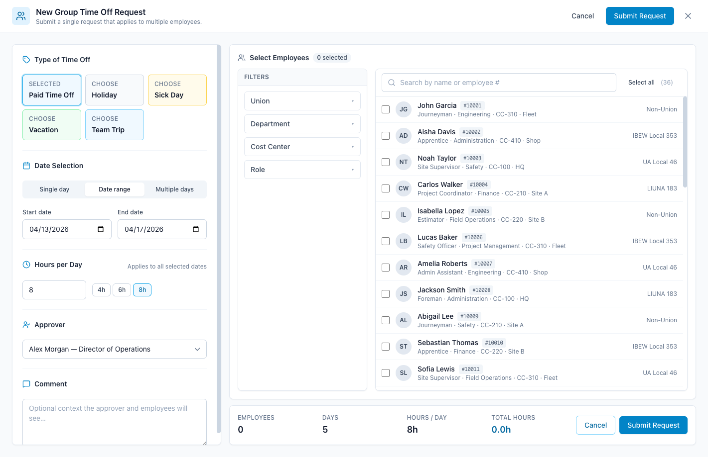
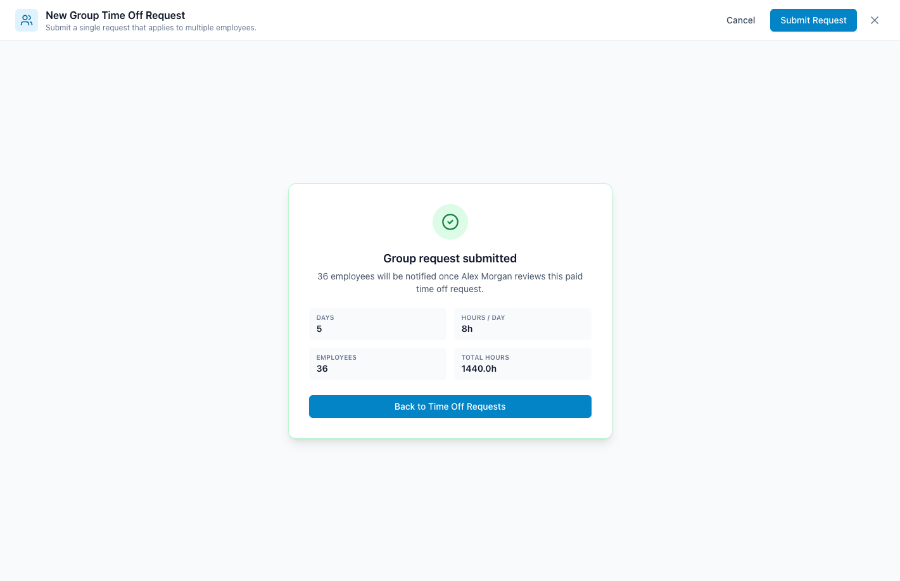

# Traqspera · Group Time Off Request Prototype

A React + Vite + Tailwind prototype that demonstrates the **Group Time Off Request** flow for the Traqspera Time Off Requests page.

> Live prototype: <https://sarafarhat13.github.io/traqspera-group-time-off>

## Preview

| Time Off Requests page | Add Request menu |
| --- | --- |
|  |  |

| Full-page Group Request modal | Submission confirmation |
| --- | --- |
|  |  |

## What's included

- **Time Off Requests page** — sidebar, navbar, balances, filters, calendar (April 2026 mock).
- **Add Request dropdown** with two options: *Individual Request* and *Group Request*.
- **Full-page Group Request modal** with a two-column layout:
  - **Left column — Request details**
    - Type of time off (Paid Time Off, Holiday, Sick Day, Vacation, Team Trip)
    - Date selection (single day, date range, or multiple individual days)
    - Hours per day (applied to all selected dates, with 4 / 6 / 8 hour presets)
    - Approver dropdown
    - Comment box
  - **Right column — Employee selection**
    - Filter panel for Union, Department, Cost Center, Role
    - Search by name or employee number
    - Select-all / deselect-all for current filter result
    - Live "Selected" count chip
  - **Sticky summary footer** showing total employees, days, hours/day and total hours, plus inline validation and submit action.
- **Success state** confirming the request after submission.

## Design system

Styling is driven by Tailwind tokens that mirror the **Modus Blueprint Design System** (Inter typography, sky-blue primary, slate neutrals, success / warning / danger semantics, etc.). Tokens live in [`tailwind.config.js`](./tailwind.config.js) and component primitives in [`src/index.css`](./src/index.css).

## Local development

```bash
npm install
npm run dev          # http://localhost:5173
```

## Production build

```bash
npm run build        # outputs to dist/
npm run preview      # serve the production build locally
```

## Deploy to GitHub Pages

The project is wired up with the [`gh-pages`](https://www.npmjs.com/package/gh-pages) package and `vite.config.js` already sets the correct `base` for the production build.

```bash
npm run deploy
```

That command runs `npm run build` first, then publishes the `dist/` folder to the `gh-pages` branch. Enable **Pages → Deploy from branch → gh-pages → /(root)** in the repository settings.

## Project structure

```
src/
  App.jsx                       # App shell
  main.jsx                      # React entry
  index.css                     # Tailwind + design tokens
  data/mockData.js              # Employees, balances, calendar events
  components/
    Navbar.jsx
    Sidebar.jsx
    TimeOffPage.jsx             # Time Off Requests page
    BalanceCards.jsx
    FilterPanel.jsx
    ViewToggle.jsx
    CalendarView.jsx
    AddRequestMenu.jsx          # "Add Request" dropdown
    GroupRequestModal.jsx       # Full-page Group Request modal
    EmployeeSelector.jsx        # Filters + employee list
```

## Notes

- All data is mocked client-side. There are no API calls.
- The submit handler logs the request payload to the console — wire this up to your backend when integrating.
